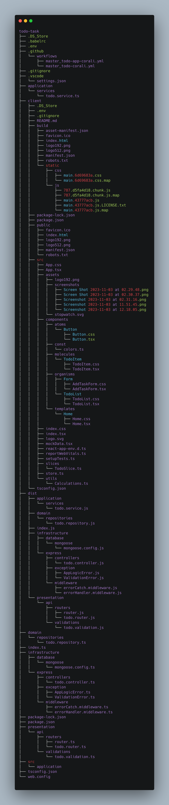

# todo-Corali

Here I have hosted the app on azure and render
[Demo-Azure](http://todo-corali.azurewebsites.net/)
[Demo-Render](https://todo-task-4p5f.onrender.com/)

# redux toolkit's role in this project

    State Management: Redux Toolkit manages the application's state, including data related to tasks, their statuses, and priorities. This state is stored centrally and can be accessed and updated from various components.

    Reducers and Actions: Redux Toolkit defines reducers and actions using a more streamlined syntax. The createSlice function is used to create reducers and actions, reducing boilerplate code and improving readability.

    Action Creators: Redux Toolkit automatically generates action creators for each action, eliminating the need to write these functions manually. This simplifies the process of dispatching actions.

    Immutability: Redux Toolkit enforces immutability when updating the state. It ensures that state changes are made in an immutable way, making it easier to track and debug issues.

    Redux Store Configuration: Redux Toolkit simplifies the configuration of the Redux store. It provides a configureStore function, which sets up the store with sensible defaults and middleware such as Thunk.

    Middleware: Middleware, such as Thunk, is used for handling asynchronous actions. Redux Toolkit makes it easy to integrate and configure middleware as needed.

    DevTools Integration: Redux Toolkit supports the integration of browser devtools, making it easier to debug the state and actions in the application.

    Performance Optimizations: Redux Toolkit includes performance optimizations, such as memoized selectors, to avoid unnecessary re-renders and computations.

    Data Normalization: It simplifies data normalization techniques, allowing you to structure your data efficiently for the application.

## Table of Contents

- [Introduction](#introduction)
- [Features](#features)
- [Installation](#installation)
- [Usage](#usage)

## Introduction

Welcome to redux-toolkit-todo! This project is a simple todo app which i uised to learn redux toolkit. It is designed it simply to add tasks with simple UI(like paper pencil).

Thank you for the Intervest Software Technologies for given the task.

## Features

Features

redux-toolkit-todo is a powerful task management application with a wide range of features designed to streamline your daily tasks and keep you organized. Some of its key features include:

    Task Creation: Easily create and manage tasks with a user-friendly interface.

    Task Prioritization: Assign priority levels (Critical or Normal) to your tasks to focus on what matters most.

    Deadline Management: Set deadlines for your tasks with Date & time.

    Task Status: Track the status of your tasks (Active or Completed) for a clear overview of your progress.

    Filtering: Quickly filter tasks by status (All, Active, or Completed) for efficient task management.

    Drag-and-Drop Reordering: Organize your tasks by dragging and dropping them to change their order.

    Clear All Tasks: Remove completed tasks and declutter your to-do list in one click.

    Intuitive User Interface: redux-toolkit-todo features an intuitive, user-friendly interface for a seamless user experience.

    Error Handling: Receive instant feedback and error messages to help resolve issues efficiently.

    Local Storage: Store your tasks and settings in mongoDB (atlas cloud) using node/express backend.

    Toast Notifications: Toast notifications provide real-time feedback on actions, such as successful task creation or priority changes.

    Responsiveness: [Your Project Name] is responsive and adapts to different screen sizes, making it accessible on a variety of devices, from desktop computers to mobile phones.

    Unit test: Did simple tests

## Installation

Make sure you installed Git, Node.js in your computer

```bash
# Clone the repository
git clone https://github.com/Dilaxn/todo-task

# Change directory to the project folder
cd todo-task

# Install dependencies
npm install

# Build the project
npm run build

# Navigate to client
cd client

# Install dependencies
npm install

# Build the frontend
npm run build

# back to the project
cd ..

# Start the project
npm start
```

## Backend <a name="backend"></a>

Application Layer <a name="application-layer"></a>

    application/services/todo.service.ts: Backend service for Todo functionality.

Domain Layer <a name="domain-layer"></a>

    domain/repositories/todo.repository.ts: Repository for interacting with Todo entities.

Infrastructure Layer <a name="infrastructure-layer"></a>

    infrastructure/database/mongoose/mongoose.config.ts: Configuration for Mongoose (MongoDB).
    infrastructure/express/controllers/todo.controller.ts: Controller handling HTTP requests for Todos.
    infrastructure/express/exception: Custom exceptions for application and validation errors.
    infrastructure/express/middleware: Error handling middleware.

## Usage




Thank you.
